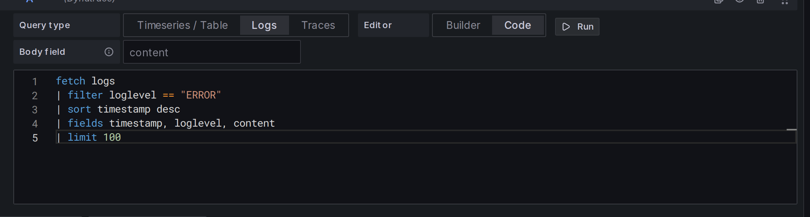
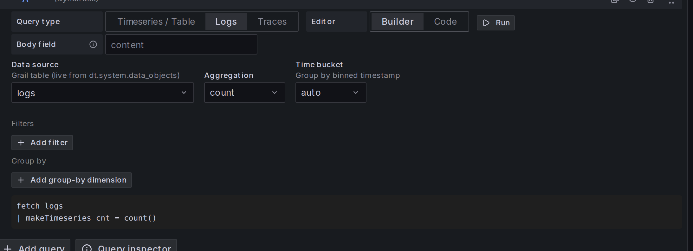

# Dynatrace Grail (DQL) data source for Grafana

Query [Dynatrace Grail](https://docs.dynatrace.com/docs/discover-dynatrace/references/dynatrace-query-language)
from Grafana using **Dynatrace Query Language (DQL)** — the same syntax you
already write in the Dynatrace UI. Build panels, alert rules, dashboard
variables, and annotations against a Dynatrace platform tenant, with metrics,
logs, traces, and events rendered as native Grafana visualizations.

[](https://github.com/discostu105/grafana-grail-datasource/releases)
[](LICENSE)




## Features

- **Write DQL.** Author queries in a Monaco editor
  with DQL syntax highlighting, one-keystroke formatting (`Shift+Alt+F`), and
  **autocomplete backed by your live Grail schema** — or build them visually
  with the [Builder/Code toggle](#querying-grail-with-dql), whose source list
  is populated from your tenant's own data objects.
- **Metrics, logs, and tables as native panels.** Timeseries and table result
  shapes, real Grail `timeframe + interval` series (not synthetic timestamp
  arrays), unit and display-name field config from labels, and a logs view
  with [derived fields](#logs), a log-volume histogram, and log-row context.
- **Distributed traces.** A clickable trace list, full span detail (an
  OpenTelemetry-compatible field set), and **trace-to-logs / trace-to-metrics**
  correlation back into Grail. See [Traces](#traces).
- **Works everywhere in Grafana.** [Alert rules](#alerting),
  [annotations](#annotations), [template/variable queries](#variables), and
  [ad-hoc filters](#ad-hoc-filters) — all sharing the same
  [server-side macro expansion](#macros), so an alert evaluates over its own
  window exactly like the panel it came from.
- **Production backend.** A Go backend with retry-and-backoff on `429`/`5xx`
  (honoring `Retry-After`), a per-instance concurrency cap, request-context
  cancellation, and Prometheus self-metrics.

## Requirements

- A **Dynatrace platform tenant** — the `https://<env>.apps.dynatrace.com`
  host (not the classic `*.live.dynatrace.com` host).
- A **platform token** (`dt0s16.*`) with the scopes for the data you query
  (see [Configuration](#configuration)).
- **Grafana ≥ 12.3.0.**

## Installation

Once the plugin is available in the [Grafana plugin catalog](https://grafana.com/grafana/plugins/):

```bash
grafana-cli plugins install discostu105-grail-datasource
```

Then restart Grafana and add the data source (below).

To run a self-hosted or locally built copy, drop the packaged plugin into
Grafana's plugin directory, or build it from source — see
[CONTRIBUTING.md](CONTRIBUTING.md). An unsigned local build also needs

```ini
[plugins]
allow_loading_unsigned_plugins = discostu105-grail-datasource
```

in `grafana.ini`.

## Configuration

1. **Create a platform token** (`dt0s16.*`) in Dynatrace →
   **Settings → Access Tokens → Platform tokens**. Grail authorizes a read with
   a **bucket** scope _and_ a **table** scope, so always grant
   `storage:buckets:read` alongside the table scopes for the data you query:
   - `storage:buckets:read` — **always required**; without bucket access every
     query is denied regardless of the table scopes below
   - `storage:logs:read` — logs; also the scope the **Save & test** probe needs
     (it runs `fetch logs | limit 1`)
   - `storage:metrics:read` — timeseries / metrics
   - `storage:events:read` — events / problems (`dt.davis.events`, `dt.davis.problems`)
   - `storage:spans:read` — traces
   - `storage:bizevents:read` — business events _(optional)_
   - `storage:system:read` — the visual builder's source dropdown
     (`fetch dt.system.data_objects`)
   - `storage:smartscape:read` — `smartscapeNodes` topology queries (e.g. the
     host-name variable example below)
2. In Grafana → **Connections → Data sources → Add** → search **Grail (DQL)**.
3. Fill in:
   - **Tenant URL** — `https://<env>.apps.dynatrace.com`
   - **API token** — your `dt0s16.*` platform token (stored encrypted via
     `secureJsonData`).
   - **Query timeout (s)** — default 30; raise for heavy DQL.
   - **Default timeframe** — used when no panel range exists (variable queries,
     alerting probes). A Go duration string, default `1h`.
4. Click **Save & test**.

## Provisioning

```yaml
apiVersion: 1
datasources:
  - name: Dynatrace Grail
    type: discostu105-grail-datasource
    access: proxy
    jsonData:
      tenantUrl: https://<env>.apps.dynatrace.com
      queryTimeoutSeconds: 30
      defaultTimeframe: 1h
    secureJsonData:
      apiToken: ${DT_TOKEN}
```

## Querying Grail with DQL

Each query has a **type** (Timeseries / Logs / Traces) and an editor **mode**:

- **Code** — a Monaco editor for DQL: syntax highlighting, bracket matching,
  `Ctrl/Cmd + Enter` to run, `Shift + Alt + F` (or the **Format** button) to
  pretty-print, and autocomplete driven by your tenant's live Grail schema.
- **Builder** — a form (data source, filters, group-by, aggregation, time
  bucketing) that generates DQL for you. The source dropdown is populated live
  from your tenant's fetchable tables, plus pinned `metrics` and
  `smartscapeNodes` entries. Switching from Builder to Code keeps the generated
  query; switching back warns before overwriting hand-written DQL.



## Example queries

**Timeseries** — host CPU bucketed by host:

```dql
timeseries cpu = avg(dt.host.cpu.usage), by:{dt.smartscape.host}, from:"$__timeFrom", to:"$__timeTo"
```

Bind the window with the `from:`/`to:` parameters: Grail scopes the metric scan
to the panel/alert range at the source (pushed down), and the bound is explicit
rather than relying on the request's _default_ timeframe — which any in-query
timeframe overrides and which isn't present for every caller. **Don't**
post-filter a timeseries with `$__timeFilter(timestamp)`: a `timeseries` result
has no per-row `timestamp` (only `timeframe`/`interval` metadata), and filtering
after aggregation can't shrink the scan.

**Records** — `fetch` takes the same `from:`/`to:` parameters, so bind the scan
there too:

```dql
fetch dt.davis.events, from:"$__timeFrom", to:"$__timeTo"
| fields timestamp = start_time, title = event.name, text = description
```

Use `$__timeFilter(<field>)` (see [Macros](#macros)) only for the narrower case
of filtering rows on a _specific_ timestamp field that differs from the scan
bound — e.g. `| filter $__timeFilter(start_time)`. It's a row filter, never a
substitute for bounding the scan, and it can't shrink a `timeseries` result.

**Table** — top hosts by current CPU:

```dql
timeseries cpu = avg(dt.host.cpu.usage), by:{dt.smartscape.host}, from:"$__timeFrom", to:"$__timeTo"
| fieldsAdd current = arrayLast(cpu)
| filter isNotNull(current)
| fields dt.smartscape.host, current
| sort current desc
```

**Traces** — fetch spans and set the query type to **Traces**; the plugin maps
them onto Grafana's trace view:

```dql
fetch spans, from:"$__timeFrom", to:"$__timeTo"
| filter service.name == "frontend"
| sort start_time desc
| limit 200
```

Rows render as a clickable trace list; selecting a trace opens the span
waterfall, and trace-to-logs / trace-to-metrics links (configured on the data
source) jump from a span back into Grail.

**Variable query** — host names for a dashboard dropdown:

```dql
smartscapeNodes "HOST"
| fields name
| sort name asc
```

## Macros

| Macro                         | Expands to                                                             |
| ----------------------------- | ---------------------------------------------------------------------- |
| `$__timeFrom` / `$__fromTime` | panel from as RFC3339 string                                           |
| `$__timeTo` / `$__toTime`     | panel to as RFC3339 string                                             |
| `$__from`                     | epoch ms (integer)                                                     |
| `$__to`                       | epoch ms (integer)                                                     |
| `$__interval`                 | DQL duration literal (`1s`, `5s`, …, `1d`) chosen to give ~200 buckets |
| `$__interval_ms`              | ms (integer)                                                           |
| `$__timeFilter(<field>)`      | `<field> >= "<from>" and <field> <= "<to>"`                            |
| `$__timeFilter()`             | same, with `field=timestamp`                                           |

Expansion runs **server-side**, so alert rules get the same substitutions as
panels.

## Coming from PromQL or SQL?

DQL is a pipeline language: a source command, then `|`-separated transforms.
A few rough analogies to get oriented (DQL is not PromQL or SQL — see the
[DQL reference](https://docs.dynatrace.com/docs/discover-dynatrace/references/dynatrace-query-language)
for the real semantics):

| You want…                 | PromQL / SQL                   | DQL                                              |
| ------------------------- | ------------------------------ | ------------------------------------------------ |
| A metric over time        | `avg(rate(http_requests[5m]))` | `timeseries r = avg(dt.service.request.count)`   |
| Group by a dimension      | `... by (host)`                | `timeseries x = avg(m), by:{dt.smartscape.host}` |
| Filter rows               | `WHERE status = 500`           | `\| filter status == 500`                        |
| Select columns            | `SELECT a, b`                  | `\| fields a, b`                                 |
| Add a computed column     | `SELECT a+b AS c`              | `\| fieldsAdd c = a + b`                         |
| Sort / limit              | `ORDER BY x DESC LIMIT 10`     | `\| sort x desc \| limit 10`                     |
| Aggregate non-metric data | `GROUP BY host`                | `\| summarize count(), by:{host}`                |

Key gotchas: equality is `==` (not `=`), boolean operators are lowercase
`and` / `or`, and time bucketing on logs/events/spans uses `makeTimeseries`
(use `timeseries` only for the metrics store).

## Grafana-native integrations

### Alerting

Alert rules run the same DQL path as panels, with the same macro expansion. Use
a query that returns a numeric timeseries and add a Grafana threshold/reduce
expression on top — e.g. alert when average host CPU exceeds 90%:

```dql
timeseries cpu = avg(dt.host.cpu.usage), by:{dt.smartscape.host}, from:"$__timeFrom", to:"$__timeTo"
```

In the rule, add a **Reduce** (Last) and a **Threshold** (`IS ABOVE 90`) on the
`cpu` series. Because macros expand server-side, the rule evaluates over the
alert's own time window — no panel range required.

### Annotations

Set the annotation query's data source to this plugin and write DQL that
returns a time column plus optional `text` / `title` columns:

```dql
fetch events, from:"$__timeFrom", to:"$__timeTo"
| filter event.kind == "DEPLOYMENT_EVENT"
| fields timestamp, title = event.name, text = event.description
```

Grafana's standard "use query result" path renders one marker per row.

### Variables

Dashboard **query variables** run any DQL that returns a column of values
(`metricFindQuery`); a `text` / `value` column pair becomes the dropdown's
label / value. See the [variable example](#example-queries) above.

### Ad-hoc filters

Add an **ad-hoc filters** variable bound to this data source. Filter keys and
values are discovered from your tenant via Grail autocomplete (merged with a
curated set of common keys), and selected filters are appended to matching
queries automatically.

### Traces

Query type **Traces** maps `fetch spans` rows onto Grafana's
OpenTelemetry-compatible traces frame (`traceID`, `spanID`, `parentSpanID`,
`operationName`, `serviceName`, `startTime`, `duration`, `kind`, `statusCode`,
`tags`). A roll-up query renders a clickable trace list; a per-span query
renders the waterfall. Configure **Trace to logs** and **Trace to metrics** on
the data source to jump from a span back into Grail.

### Logs

Query type **Logs** renders the logs panel with a severity-broken-down
log-volume histogram, "show context" for surrounding lines, and **derived
fields** — regex matches on the log body become clickable link columns (e.g. a
trace ID → a trace query). Set the body column with the **Log message field**
input (defaults to `content`).

## Troubleshooting

| Symptom                                        | Likely cause / fix                                                                                                                            |
| ---------------------------------------------- | --------------------------------------------------------------------------------------------------------------------------------------------- |
| **Save & test:** "Authentication rejected"     | Token is invalid or expired. Create a fresh `dt0s16.*` platform token.                                                                        |
| **Save & test:** "Token lacks required scopes" | Add the missing `storage:*:read` scope (see [Configuration](#configuration)). The probe needs `storage:logs:read` and `storage:buckets:read`. |
| **Save & test:** "Cannot reach …" / TLS error  | Tenant URL is wrong or unreachable. Use the `https://<env>.apps.dynatrace.com` (platform) host, not the classic `*.live.dynatrace.com` host.  |
| Query returns empty but no error               | Your time range has no data, or a `filter` is too strict. Check the panel's **Inspect → Query** for the expanded DQL and any Grail notices.   |
| "dqlQuery is empty"                            | The panel has no DQL text. Enter a query or switch to the visual builder.                                                                     |
| Timeouts on heavy queries                      | Raise **Query timeout (s)** in the data source config and narrow the DQL (`limit`, tighter filters, longer bucket size).                      |
| Percentile/median returns empty for metrics    | DQL needs an explicit `rollup` — the visual builder adds `, 95, rollup: avg` automatically; do the same in hand-written DQL.                  |

Grail sampling / scan-limit notices are surfaced as panel notices — open
**Inspect → Query** to see them.

## Known limitations

- Annotations use Grafana's standard "use query result" path; the result
  columns must be named `time`/`timestamp`, `title`, and `text` (there is no
  dedicated column picker).

## Documentation & roadmap

- **[`docs/`](docs/)** — the development record and roadmap (per-milestone
  requirements and status).
- **[`CHANGELOG.md`](CHANGELOG.md)** — version history (Keep a Changelog).
- **[Dynatrace DQL reference](https://docs.dynatrace.com/docs/discover-dynatrace/references/dynatrace-query-language)** —
  the query language itself.

## Contributing & support

Bug reports and feature requests:
[GitHub issues](https://github.com/discostu105/grafana-grail-datasource/issues).
Security reports: see [SECURITY.md](SECURITY.md). Development setup, build, and
test instructions are in [CONTRIBUTING.md](CONTRIBUTING.md). Licensed under
[Apache-2.0](LICENSE).
